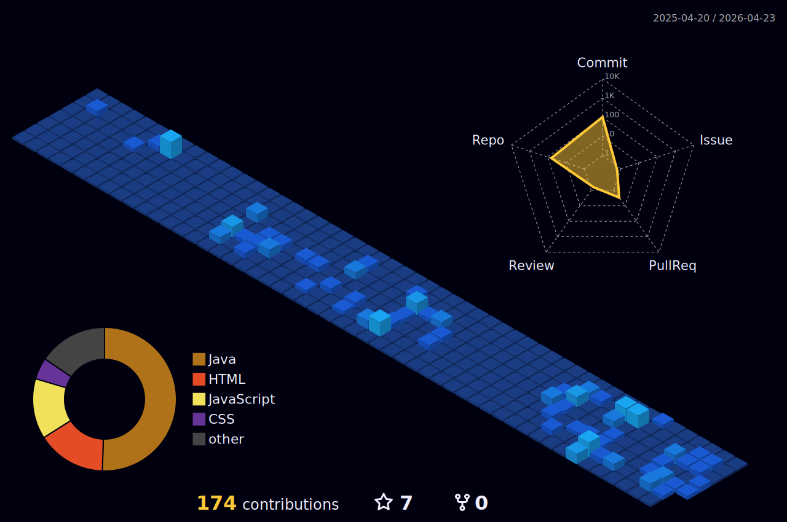

<h1 align="center">FELIPEZORD</h1>

  Desenvolvedor Back-End

---

Felipe | Desenvolvedor de Sistemas & Infraestrutura de TIC
Olá! Sou o Felipe, tenho 17 anos e sigo uma trajetória intensiva de formação técnica dupla: TI no Senac SP e Análise e Desenvolvimento de Sistemas no SENAI Suíço-Brasileira. Sou um entusiasta da tecnologia com foco em infraestrutura e desenvolvimento Full Stack.

---

### 

  
  
  
  
  
  
  
  
  
  
  
  
  
  
    
  
    
  
    
  
  
  
  

###

---

  

