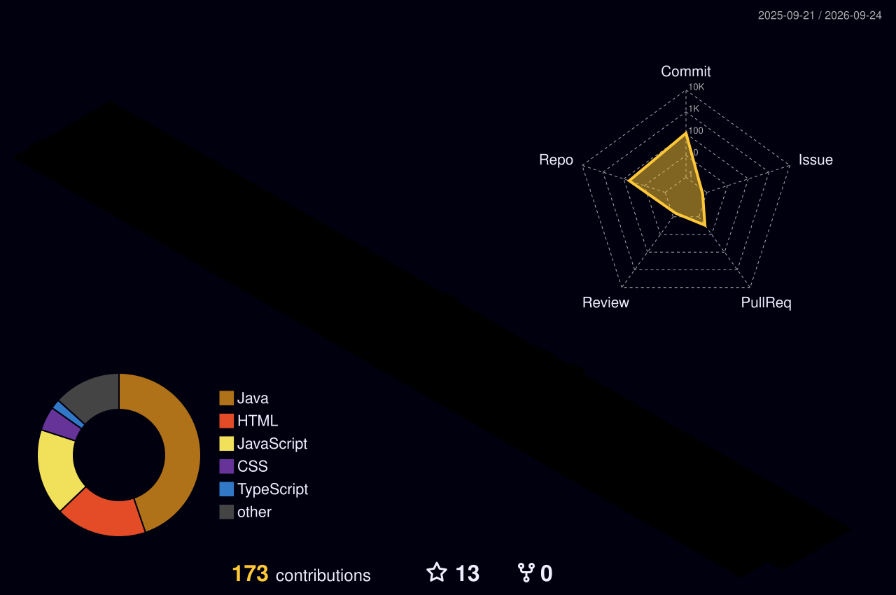

---

  Desenvolvedor Full stack com foco em Back-end 

---

Felipe | Desenvolvedor de Sistemas & Infraestrutura de TIC 
Olá! Sou o Felipe, sigo uma trajetória intensiva de formação técnica dupla: TI no Senac SP e Análise e Desenvolvimento de Sistemas no SENAI Suíço-Brasileira. Sou um entusiasta da tecnologia com foco em infraestrutura e desenvolvimento Full Stack.

---

  
  
  
  
  
  
  
  
  
  
  
  
  
  
  
  
  
  
  
    
  
    
  
    
  
  
  

---

  

---

  <picture>
    <source media="(prefers-color-scheme: dark)" srcset="https://raw.githubusercontent.com/SEU_USUARIO_GITHUB/SEU_USUARIO_GITHUB/output/pacman-contribution-graph-dark.svg">
    <source media="(prefers-color-scheme: light)" srcset="https://raw.githubusercontent.com/SEU_USUARIO_GITHUB/SEU_USUARIO_GITHUB/output/pacman-contribution-graph.svg">
    
  </picture>

                          

